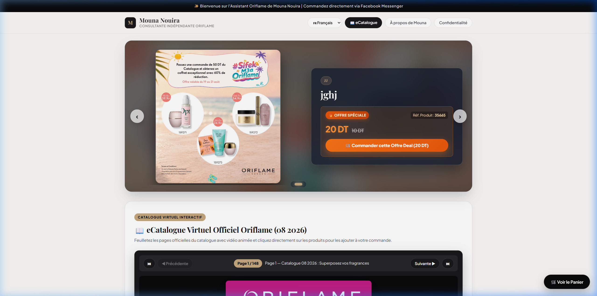
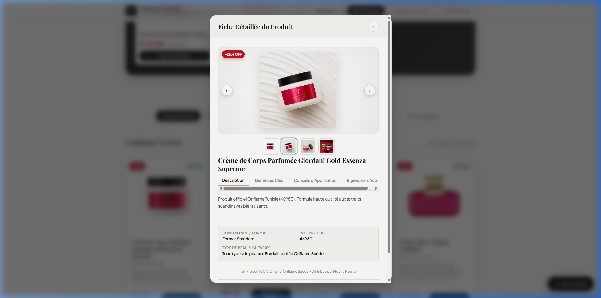
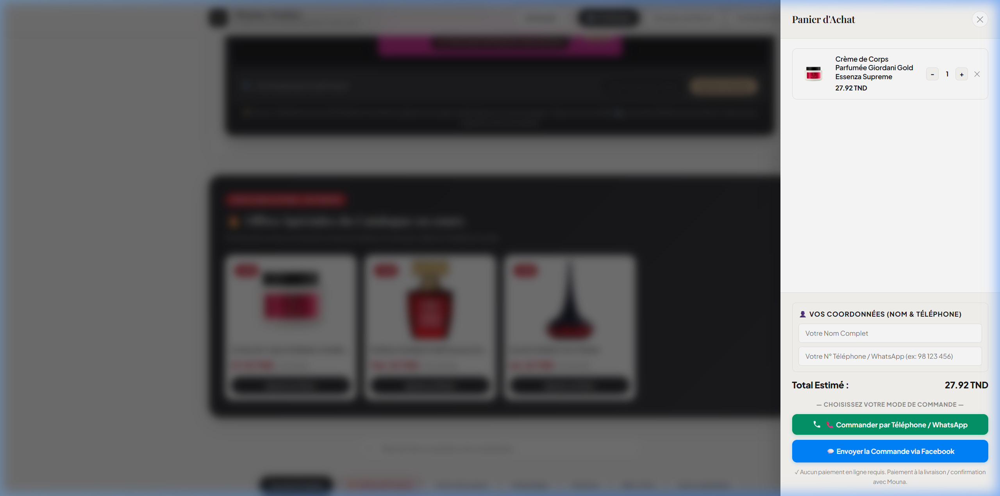
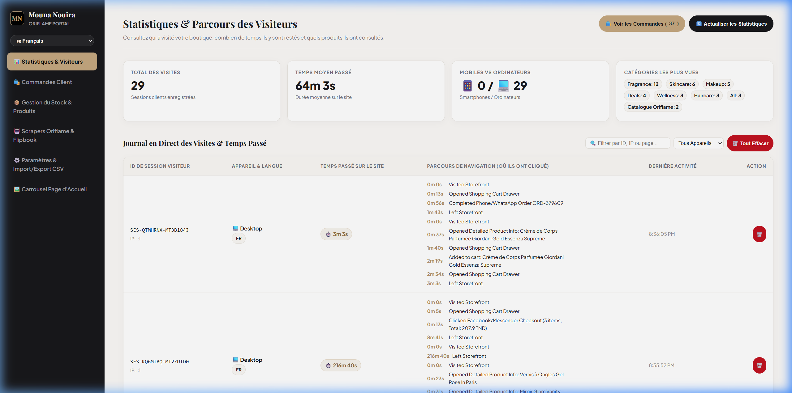
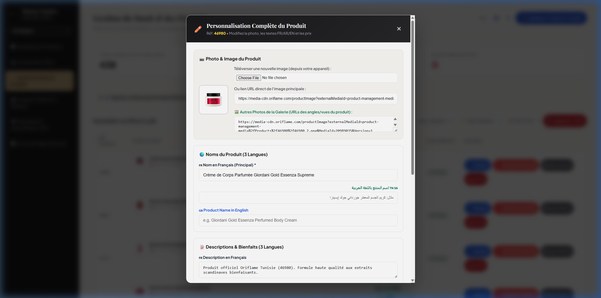

# 🌸 Mouna Nouira — Boutique & E-Commerce Oriflame Suède

<div align="center">

  [](https://mouna-nouira.wasmer.app/)
  [](https://mouna-nouira.wasmer.app/admin)
  [](https://nodejs.org)
  [](LICENSE)

  <p align="center">
    <strong>Boutique en ligne haut de gamme &amp; portail de vente direct pour la Consultante VIP Oriflame Suède Mouna Nouira en Tunisie.</strong><br>
    Catalogue interactif, personnalisation multilingue (Français, Arabe, Anglais), galerie multi-photos HD, commande directe WhatsApp &amp; Messenger, scraping et synchronisation automatique.
  </p>

  <p align="center">
    <a href="https://mouna-nouira.wasmer.app/">🌐 <strong>Accéder au Site en Direct</strong></a> •
    <a href="https://mouna-nouira.wasmer.app/admin">🔐 <strong>Espace Administration</strong></a> •
    <a href="#-fonctionnalités-clés">✨ <strong>Fonctionnalités</strong></a> •
    <a href="#-galerie--captures-décran">📸 <strong>Captures d'écran</strong></a> •
    <a href="#-guide-dinstallation-locale">🚀 <strong>Installation</strong></a>
  </p>

</div>

---

## 📸 Galerie & Captures d'écran

### 🛍️ 1. Vitrine Client Haut de Gamme & Offres Spéciales
Interface moderne avec carrousel promotionnel dynamique, bandeau d'offres catalogue personnalisables et sélection rapide par catégorie.

<p align="center">
  
</p>

---

### 🔍 2. Visionneuse Rapide (QuickView) & Galerie Multi-Angles HD
Affichage instantané avec zoom, vignettes interactives pour toutes les vues et angles (`_1.png` à `_4.png`), composition détaillée, conseils d'utilisation et bienfaits.

<p align="center">
  
</p>

---

### 🛒 3. Panier Interactif & Commande Directe WhatsApp / Messenger
Calcul immédiat des remises (-20% société ou promotions en cours) et envoi de la commande pré-formatée directement sur WhatsApp (`55 756 629`) ou Facebook Messenger.

<p align="center">
  
</p>

---

### 📊 4. Tableau de Bord Analytique & Statistiques en Direct
Suivi en temps réel des visiteurs, de la durée moyenne des sessions, des types d'appareils (Mobile, Tablette, Desktop) et des catégories les plus consultées.

<p align="center">
  
</p>

---

### ✏️ 5. Gestionnaire de Stock & Personnalisation Multilingue (FR / AR / EN)
Gestion complète de l'inventaire avec édition sur-mesure : noms et descriptions en 3 langues, photos principales et galerie multi-angles, prix catalogue et statut de stock.

<p align="center">
  
</p>

---

## ✨ Fonctionnalités Clés

### 🌍 Expérience Client Multilingue & Adaptée
- **🇫🇷 Français, 🇹🇳/🇸🇦 Arabe (RTL complet), 🇬🇧 Anglais** : Changement de langue instantané sans rechargement.
- **📖 Catalogue Numérique Flipbook Shoppable** : Navigation page par page avec hotspots interactifs cliquables vers le panier.
- **⚡ Recherche Intuitive & Filtres Instantanés** : Recherche par nom, code référence produit (ex: `46980`, `40683`), ou catégorie (Soins du visage, Parfums, Maquillage, Corps &amp; Bain, Bien-être, Cheveux).
- **🏷️ Remise Société Personnalisable (-20%)** : Activation en 1 clic de la remise VIP sur l'ensemble du catalogue ou produit par produit.

### 📱 Canaux de Vente & Commande Directe
- **💬 WhatsApp Instant Checkout** : Génère un message pré-rempli détaillé envoyé automatiquement au numéro de Mouna Nouira (`+216 55 756 629`).
- **🤖 Facebook Messenger API** : Intégration Facebook Graph API pour confirmation automatisée par Messenger.
- **📞 Commande Téléphonique** : Appel direct en 1 clic.

### 🎛️ Espace Administration (`/admin`)
- **🔐 Accès Sécurisé** : Protection par mot de passe administrateur (`mouna2026`).
- **🔥 Gestionnaire des "Offres Spéciales du Catalogue"** : Choix des produits mis en avant dans le bandeau noir d'accueil.
- **🖼️ Gestionnaire du Carrousel d'Accueil** : Ajout, modification, réorganisation et suppression de bannières grand format.
- **📊 Importation &amp; Exportation Intégrale** :
  - **CSV Avancé (Excel)** : 23 colonnes avec encodage UTF-8 BOM pour préserver les caractères arabes et accents français.
  - **JSON 100% Fidèle** : Sauvegarde et restauration complète de toute la boutique en un clic.
- **⚡ Moteur de Scraping &amp; Synchronisation Globale** : Extraction automatisée des nouveaux produits, visuels multi-angles HD et fiches techniques depuis le site officiel Oriflame Tunisie.

---

## 🛠️ Stack Technique

| Domaine | Technologies |
|---|---|
| **Backend** | [Node.js](https://nodejs.org) (v18+), [Express.js](https://expressjs.com), [Multer](https://github.com/expressjs/multer), [CORS](https://github.com/expressjs/cors), [dotenv](https://github.com/motdotla/dotenv) |
| **Frontend** | Vanilla JavaScript ES6+ (Architecture Modulaire), HTML5 Sémantique, CSS3 Moderne (Glassmorphism, CSS Variables, Animations) |
| **Web Scraping** | [Puppeteer](https://pptr.dev), [Cheerio](https://cheerio.js.org), Axios |
| **Intégrations API** | Meta Graph API (Facebook &amp; Messenger Platform), WhatsApp Click-to-Chat Protocol |
| **Hébergement &amp; Déploiement** | [Wasmer Edge](https://wasmer.io) / Wasmer App Platform |

---

## 🚀 Guide d'Installation Locale

### 1. Prérequis
- [Node.js](https://nodejs.org) (version 18 ou supérieure recommandée)
- `npm` ou `yarn`

### 2. Cloner le Dépôt
```bash
git clone https://github.com/hakimnouira/personal-vending-page.git
cd personal-vending-page
```

### 3. Installer les Dépendances
```bash
npm install
```

### 4. Configurer les Variables d'Environnement
Créez un fichier `.env` à la racine (optionnel pour Messenger) :
```env
PORT=3000
FB_APP_ID=votre_facebook_app_id
FB_APP_SECRET=votre_facebook_app_secret
FB_PAGE_ACCESS_TOKEN=votre_page_access_token
FB_PAGE_ID=votre_page_id
```

### 5. Démarrer le Serveur
```bash
npm start
# ou
node server.js
```

Accédez ensuite à l'application dans votre navigateur :
- **Boutique Client** : [http://localhost:3000](http://localhost:3000)
- **Espace Admin** : [http://localhost:3000/admin](http://localhost:3000/admin) *(Mot de passe : `mouna2026`)*

---

## 📁 Structure du Projet

```text
personal-vending-page/
├── assets/
│   └── screenshots/              # Captures d'écran de l'application
├── data/
│   ├── analytics.json            # Statistiques visiteurs et logs d'activité
│   ├── carousel.json             # Diapositives du carrousel d'accueil
│   ├── orders.json               # Historique des commandes
│   ├── products.json             # Base de données catalogue (430+ produits)
│   └── settings.json             # Paramètres (WhatsApp, FB, mot de passe, offres)
├── js/
│   ├── admin-i18n.js             # Moteur de traduction du portail admin (FR/AR/EN)
│   ├── admin-page.js             # Contrôleur complet du tableau de bord admin
│   ├── app.js                    # Contrôleur principal de la boutique cliente
│   ├── cart.js                   # Moteur du panier et validation des commandes
│   └── i18n.js                   # Moteur de traduction côté client
├── services/
│   ├── scraper.js                # Scraper officiel Oriflame (catégories & multi-images)
│   ├── flipbook-scraper.js       # Scraper du catalogue interactif & hotspots
│   └── messenger.js              # Service d'envoi des confirmations Messenger
├── styles/
│   ├── admin.css                 # Styles de l'espace administration
│   └── main.css                  # Styles de la boutique cliente et du panier
├── admin.html                    # Page du portail administrateur
├── index.html                    # Page principale de la boutique cliente
├── server.js                     # Serveur Express & routes API
└── package.json                  # Dépendances et scripts
```

---

## 🌐 Déploiement en Ligne

L'application est déployée et accessible publiquement sur **Wasmer Edge** :

🔗 **[https://mouna-nouira.wasmer.app/](https://mouna-nouira.wasmer.app/)**

---

## 📄 Licence & Droits

Conçu et développé sur-mesure pour **Mouna Nouira** — Consultante Beauté Indépendante Oriflame Suède.  
Distribué sous licence MIT.
